# Project Process Flow

Internal reference for the Smart Study Planner project process. This document is intentionally kept outside the Streamlit app so it does not appear to end users.

```mermaid
flowchart LR
    setup["Project setup<br/>Environment, folders, Streamlit shell"]
    course["Course workspace<br/>Create or select active course"]
    plan["Study planning<br/>Exam date, hours, lectures, weak topics"]
    upload["Material upload<br/>PDFs, slides, notes, text files"]
    index["RAG indexing<br/>Extract, chunk, embed, retrieve"]
    chat["Study chat<br/>Route questions and answer with sources"]
    quiz["Quiz loop<br/>Generate, answer, score, detect weak topics"]
    progress["Progress control<br/>Tasks, reminders, deadlines, dashboard"]
    demo["Review and demo<br/>Validation notes and final walkthrough"]

    setup --> course --> plan --> upload --> index --> chat --> quiz --> progress --> demo
    quiz --> plan
    progress --> plan
```



## Process Stages

| Stage | Owner | Output |
| --- | --- | --- |
| Project setup | Developer | Runnable local workspace with configured app structure |
| Course workspace | Student | Course-scoped memory bucket for plans, uploads, quizzes, and chat |
| Study planning | Study Planner Agent | Prioritized task timeline with checkpoints |
| Material upload | Student | Course source library |
| RAG indexing | Retrieval layer | Searchable course knowledge |
| Study chat | Router, Supervisor, RAG Agent | Source-backed coaching and explanations |
| Quiz loop | Quiz Generator and Progress Evaluator | Scores, feedback, flashcards, and weak-topic signals |
| Progress control | Dashboard and Reminder Agent | Analytics, due work, deadlines, and reminders |
| Review and demo | Developer | Evidence for the final project walkthrough |


# 1. Application Idea

Rafeeqak is a Streamlit-based AI study assistant for students. It helps a student manage courses, upload course materials, ask questions about those materials, generate study plans, take quizzes, track weak topics, and review progress.

It is useful because students usually study several courses at the same time, and their notes, deadlines, quizzes, weak topics, and chat history can become mixed together. Rafeeqak solves this by keeping data course-scoped.

It is different from a normal chatbot because it is not only a chat box. It has course selection, uploaded-material retrieval, study planning, quiz generation, scoring, progress tracking, reminders, memory, and Arabic/English localization.

# 2. What the App Provides

| Item | Status | Evidence |
|---|---:|---|
| Authentication | Complete | `src/auth/service.py`, `src/ui/login_page.py`, `src/ui/signup_page.py` |
| Local demo login fallback | Complete | `build_local_demo_user()` in `src/auth/service.py` |
| Session persistence | Complete | `src/auth/session_persistence.py`, local workspace save in `src/tools/state.py` |
| Course creation/selection | Complete | `app.py`, `src/tools/state.py` |
| Upload course materials | Complete | `src/ui/upload_page.py`, `src/retrieval/course_materials.py` |
| RAG chat over uploaded files | Complete | `src/agents/course_rag.py`, `src/retrieval/course_materials.py` |
| Study plan generation | Complete | `src/agents/study_planner.py`, `src/ui/study_plan_page.py` |
| Quiz generation | Complete | `src/agents/quiz_generator.py`, `src/ui/quiz_page.py` |
| Quiz evaluation/scoring | Complete | `src/agents/progress_evaluator.py` |
| Weak-topic tracking | Complete | `src/agents/progress_evaluator.py`, `src/ui/quiz_page.py` |
| Dashboard/progress summary | Complete | `src/ui/dashboard_page.py` |
| Arabic/English support | Complete | `src/localization.py`, `src/ui/theme.py` |
| Reminders/settings | Complete | `src/agents/reminder_agent.py`, `src/ui/settings_page.py` |
| Supabase memory | Partial | Implemented, but depends on configured `SUPABASE_URL` and `SUPABASE_KEY` |
| Local persistence fallback | Complete | `data/user_state` logic in `src/tools/state.py` |
| Multimodal input | Partial | Supports document formats only: PDF, DOCX, PPTX, MD, TXT. No image/audio understanding. |

# 3. Technologies and Tools Used

| Area | Technology / Tool | Why We Used It |
|---|---|---|
| UI | Streamlit | Fast Python UI for forms, chat, file upload, dashboard, and pages |
| Language | Python | Main app, agents, retrieval, state, and tests |
| LLM | Gemini / `google-genai` | Optional LLM generation for chat, RAG answers, quizzes, plans, summaries, reminders |
| Retrieval | Custom local sparse RAG | `CourseMaterialIndexer` stores token vectors in JSON and searches by cosine similarity |
| Database | Supabase | Optional cloud auth and memory storage |
| Local storage | JSON files | Fallback workspace, RAG index, semantic cache |
| Testing | pytest | Unit and integration-style tests |
| File parsing | PyMuPDF, python-docx, python-pptx | Extract text from PDF, DOCX, PPTX |
| Data display | pandas | Tables and dashboard dataframes |
| State | `st.session_state` + helpers | Course-scoped runtime state |
| Localization | Custom dictionaries + RTL CSS | English/Arabic labels and right-to-left layout |
| Env config | python-dotenv | Loads `.env` values |
| Note | LangChain/LangGraph/Chroma/FAISS are in `requirements.txt`, but I did not find active imports in `src/`. Current retrieval is custom local sparse search. |

# 4. System Architecture

Flow:

```text
User
→ Streamlit UI
→ SupervisorAgent
→ SafetyAgent + InputRouterAgent
→ Specialist Agent
→ Memory / RAG / Database / Quiz / Planner
→ ResponseAgent + Output Filter
→ Streamlit UI
```

Architecture parts:

| Layer | Files |
|---|---|
| App shell | `app.py` |
| UI pages | `src/ui/*.py` |
| Agents | `src/agents/*.py` |
| Memory layer | `src/agents/memory_agent.py`, `src/memory/*.py` |
| RAG layer | `src/agents/course_rag.py`, `src/retrieval/course_materials.py` |
| Quiz/evaluation | `src/agents/quiz_generator.py`, `src/agents/progress_evaluator.py`, `src/ui/quiz_page.py` |
| Planner | `src/agents/study_planner.py`, `src/tools/study_plan_tasks.py` |
| Auth/session | `src/auth/*.py` |
| Prompts | `src/prompts/registry.py`, `src/prompts/templates/*` |
| Tests | `tests/*.py` |

This supports agent decomposition because routing, RAG, planning, quiz generation, evaluation, safety, reminders, and memory are separated. It supports memory design through course buckets, local JSON workspace state, Supabase tables, and chat summaries. Module boundaries are mostly clean: UI calls state/helpers and agents; agents call retrieval, prompts, and memory.

# 5. Main Features and Files Used

## Feature Name: Authentication and Session Persistence

### What it does
Allows login/sign-up with Supabase, or local demo mode if Supabase is missing.

### Why it is important
It gives each student a separated workspace and allows cloud memory when configured.

### Files used
- `src/auth/service.py` — Supabase auth wrapper and demo user.
- `src/auth/session_persistence.py` — browser cookie token persistence.
- `src/ui/login_page.py` — login UI.
- `src/ui/signup_page.py` — signup UI.
- `src/ui/account_page.py` — logout/session view.
- `src/tools/state.py` — stores authenticated user and local workspace.

### Important functions/classes
- `AuthService.sign_in()` — Supabase login.
- `AuthService.sign_up()` — Supabase signup.
- `AuthService.restore_session()` — restores auth from tokens.
- `build_local_demo_user()` — creates fallback local account.
- `bootstrap_authentication()` — restores and syncs cookies.
- `set_authenticated_user()` — stores user and loads workspace.

### How it works step-by-step
1. App starts in `app.py`.
2. `bootstrap_authentication()` tries to restore cookies.
3. Login page uses `AuthService`.
4. If Supabase is unavailable, demo login is shown.
5. Authenticated user unlocks app pages.
6. Local workspace is loaded by email.

### Problems faced
- Supabase may be unavailable.
- Streamlit refresh can lose session state.
- Tokens need browser persistence.
- Local demo still needs isolated state.

### How we solved it
- Added local demo mode.
- Stored auth tokens in cookies.
- Saved user workspace under `data/user_state`.
- Used email-based workspace file names.

### Status
Complete.

## Feature Name: Course Management and Active Course Selection

### What it does
Lets users create, rename, delete, and select active courses.

### Files used
- `app.py` — global course selector and management UI.
- `src/tools/state.py` — course data model and active course state.
- `src/retrieval/course_materials.py` — renames/removes course-indexed chunks.

### Important functions/classes
- `add_course()` — creates course bucket.
- `set_active_course()` — switches active course.
- `rename_course()` — renames course and references.
- `delete_course()` — removes local course state.
- `course_context()` — returns active course data.
- `CourseMaterialIndexer.remove_course()` — removes course files/chunks.

### How it works step-by-step
1. User creates course in top navigation.
2. Course ID is generated from course name.
3. Empty course bucket is created.
4. Active course controls chat, upload, quiz, dashboard, and plan.
5. Switching course swaps all course-scoped state.

### Problems faced
- Cross-course leakage.
- Deleting a course must remove uploads and RAG chunks.
- Legacy single-course state needed migration.

### How we solved it
- `COURSE_SCOPED_KEYS` centralizes per-course state.
- `course_data[course_id]` stores separate buckets.
- Tests verify course separation in `tests/test_phase8_multicourse.py`.

### Status
Complete.

## Feature Name: Upload Materials

### What it does
Uploads PDF, TXT, Markdown, DOCX, and PPTX files for the active course.

### Files used
- `src/ui/upload_page.py` — upload UI and file management.
- `src/retrieval/course_materials.py` — parsing, chunking, indexing.
- `src/tools/state.py` — saves upload metadata.

### Important functions/classes
- `render_upload_page()` — UI and upload workflow.
- `CourseMaterialIndexer.index_file()` — indexes one file.
- `CourseMaterialIndexer.index_all()` — indexes all course files.
- `_extract_pdf()`, `_extract_docx()`, `_extract_pptx()` — file parsers.
- `CourseMaterialIndexer.remove_file()` — delete file and chunks.

### How it works step-by-step
1. User selects active course.
2. User uploads supported files.
3. File is saved under `data/uploads/<course_id>/`.
4. Text is extracted and chunked.
5. Sparse token vectors are saved in `data/vector_store/course_materials.json`.
6. Upload metadata is saved in course bucket.

### Problems faced
- Different file formats require different parsers.
- Some files may have no readable text.
- RAG must not use another course’s files.

### How we solved it
- Supported parser-specific extraction.
- Return friendly failed indexing messages.
- Store and filter by `course_id`.

### Status
Complete.

## Feature Name: Course-Scoped RAG Chat

### What it does
Answers questions using only uploaded materials from the active course.

### Files used
- `src/ui/chat_page.py` — chat UI.
- `src/agents/supervisor.py` — routes chat requests.
- `src/agents/course_rag.py` — retrieves and answers.
- `src/retrieval/course_materials.py` — searches indexed chunks.
- `src/prompts/templates/rag_answer.*.txt` — RAG prompt.
- `src/tools/output_filter.py` — output guardrails.

### Important functions/classes
- `_assistant_reply()` — sends chat to supervisor.
- `SupervisorAgent.handle_message()` — full agent workflow.
- `CourseRAGAgent.answer()` — RAG answer entrypoint.
- `CourseMaterialIndexer.search()` — course-filtered retrieval.
- `CourseRAGAgent.needs_clarification()` — blocks vague retrieval.
- `CourseRAGAgent._compose_llm_answer()` — optional Gemini answer.
- `CourseRAGAgent._compose_offline_answer()` — fallback answer.

### How it works step-by-step
1. User asks a question in Chat.
2. Supervisor checks safety.
3. Router detects course-material intent.
4. RAG indexes active course files if needed.
5. Search filters by `course_id`.
6. Answer is generated with citations.
7. Output filter sanitizes response.

### Problems faced
- Vague questions could dump raw chunks.
- RAG could retrieve wrong-course materials.
- LLM may be unavailable.
- LLM answers need citations.

### How we solved it
- Added clarification for vague requests.
- Enforced `course_id` filtering.
- Added offline answer fallback.
- Added citation formatting and deduplication.
- Tests in `tests/test_phase5_rag.py`.

### Status
Complete.

## Feature Name: Multi-Agent Routing / Supervisor

### What it does
Coordinates safety, intent routing, specialist agents, semantic cache, and response filtering.

### Files used
- `src/agents/supervisor.py`
- `src/agents/input_router.py`
- `src/agents/safety_agent.py`
- `src/tools/semantic_cache.py`
- `src/tools/output_filter.py`

### Important functions/classes
- `SupervisorAgent.handle_message()` — main orchestrator.
- `SupervisorAgent.decide()` — maps intent to agent.
- `InputRouterAgent.route()` — detects intent/language.
- `SafetyAgent.check()` — blocks injection patterns.
- `SupervisorAgent._run_selected_agent()` — executes chosen agent.
- `SupervisorAgent._trace_step()` — records route trace.

### How it works step-by-step
1. Safety check.
2. Intent/language detection.
3. Agent selection.
4. Active-course validation.
5. Cache lookup if read-only.
6. Specialist agent runs.
7. Response is filtered and returned.

### Problems faced
- State-changing requests should not be cached.
- Course-scoped agents need active course.
- Need explainable route trace for project grading.

### How we solved it
- `_is_cacheable()` skips cache for quiz, reminder, memory, planner actions.
- Course scope validator blocks missing course.
- Trace list records every step.

### Status
Complete.

## Feature Name: Study Planner

### What it does
Generates personalized study plans using exam date, daily hours, difficulty, lecture count, finish period, weak topics, and progress.

### Files used
- `src/ui/study_plan_page.py`
- `src/agents/study_planner.py`
- `src/tools/study_plan_tasks.py`
- `src/tools/planner_localization.py`
- `src/prompts/templates/study_planning.*.txt`

### Important functions/classes
- `StudyPlannerAgent.generate()` — creates plan.
- `_build_offline_tasks()` — deterministic fallback plan.
- `_generate_tasks_with_llm()` — optional Gemini plan.
- `recommend_next()` — recommends next pending task.
- `explain_priorities()` — explains weak-topic priority.
- `apply_manual_completion_updates()` — marks tasks done.
- `mark_matching_quiz_task_completed()` — quiz completion sync.

### How it works step-by-step
1. User enters planning inputs.
2. Planner merges manual weak topics and quiz weak topics.
3. Planner validates lecture count and finish period.
4. LLM plan is tried if available.
5. Offline planner is used if LLM fails/unavailable.
6. Tasks are saved in active course bucket.
7. Reminders are generated from plan.

### Problems faced
- Plan may not cover all lectures.
- Completed tasks could still be recommended.
- Quiz tasks should not be manually marked complete.
- Arabic planner text could mix English terms.

### How we solved it
- `_complete_other_topics()` fills lecture topics.
- `select_next_task()` skips completed tasks.
- `is_quiz_task()` prevents manual completion for quiz tasks.
- `planner_localization.py` translates planner phrases.

### Status
Complete.

## Feature Name: Quiz Generation

### What it does
Generates quizzes from uploaded course material with difficulty and question types.

### Files used
- `src/ui/quiz_page.py`
- `src/agents/quiz_generator.py`
- `src/retrieval/course_materials.py`
- `src/tools/quiz_history.py`
- `src/prompts/templates/quiz_generation.*.txt`

### Important functions/classes
- `generate_quiz_from_course_materials()` — UI-level RAG quiz workflow.
- `QuizGeneratorAgent.generate()` — creates quiz payload.
- `_generate_with_llm()` — optional Gemini JSON quiz.
- `_offline_questions()` — fallback generator.
- `_store_generated_quiz()` — stores active quiz without counting attempt.
- `append_quiz_history()` — saves generated-question history.

### How it works step-by-step
1. User selects uploaded file.
2. App retrieves chunks from that file/course.
3. Quiz generator receives context chunks.
4. LLM tries to generate structured JSON.
5. If invalid, offline fallback creates questions.
6. Quiz is stored as `active_quiz`.
7. History prevents repeated questions.

### Problems faced
- LLM may return invalid JSON.
- Generated quiz might not appear.
- Repeated questions.
- Quiz could be generated from wrong material.

### How we solved it
- `LLMClient.generate_json()` validates JSON.
- Fallback questions are used.
- `_store_generated_quiz()` saves `active_quiz`.
- Quiz history is scoped by course and topic.
- UI requires matching selected-course material.

### Status
Complete.

## Feature Name: Quiz Evaluation and Weak Topics

### What it does
Scores answers, supports partial credit, records attempts, and flags weak topics.

### Files used
- `src/agents/progress_evaluator.py`
- `src/ui/quiz_page.py`
- `src/tools/study_plan_tasks.py`
- `src/agents/memory_agent.py`

### Important functions/classes
- `ProgressEvaluatorAgent.evaluate()` — scores full quiz.
- `_score_choice_question()` — MCQ/true-false scoring.
- `_score_short_answer()` — keyword partial scoring.
- `_score_matching()` — matching partial scoring.
- `_weak_topics()` — weak-topic signal.
- `_record_attempt()` — saves attempt and syncs memory.

### How it works step-by-step
1. User submits answers.
2. Evaluator scores each question.
3. Feedback is displayed.
4. Low score generates weak-topic record.
5. Attempt is saved under active course.
6. Matching quiz task can be marked completed.
7. Optional Supabase sync records quiz score.

### Problems faced
- Short-answer grading is not exact.
- Matching questions need partial scoring.
- Quiz attempts must update course dashboard.
- Quiz task completion should happen after submission, not generation.

### How we solved it
- Added keyword-based partial scoring.
- Added matching map scoring.
- Attempts update course bucket.
- `mark_matching_quiz_task_completed()` runs after evaluated submission.

### Status
Complete.

## Feature Name: Dashboard / Progress Summary

### What it does
Shows course overview, active-course metrics, quiz trend, plan overview, reminders, chat summary, and memory snapshot.

### Files used
- `src/ui/dashboard_page.py`
- `src/tools/state.py`
- `src/tools/semantic_cache.py`
- `src/retrieval/course_materials.py`
- `src/agents/reminder_agent.py`

### Important functions/classes
- `render_dashboard_page()` — dashboard UI.
- `build_dashboard_course_rows()` — course table rows.
- `due_reminder_rows()` — due reminder filtering.
- `_overall_metrics()` — all-course totals.
- `_render_memory_snapshot()` — Supabase snapshot panel.

### How it works step-by-step
1. Dashboard reads `course_context()`.
2. Shows all-course summary cards.
3. Shows active-course metrics.
4. Displays reminders and due alerts.
5. Displays quiz trend and plan hours.
6. Optionally fetches Supabase memory snapshot.

### Problems faced
- Dashboard must show all courses without mixing active-course details.
- Reminders need done/pending states.
- Supabase may be missing.

### How we solved it
- `_all_course_summaries()` aggregates per-course buckets.
- Reminder status is stored locally.
- Memory status message handles missing Supabase.

### Status
Complete.

## Feature Name: Memory and Supabase Persistence

### What it does
Stores profile, settings, plans, quiz scores, weak topics, chat summaries, and reminders in Supabase when configured. Also saves local workspace state.

### Files used
- `src/agents/memory_agent.py`
- `src/memory/repository.py`
- `src/memory/supabase_client.py`
- `docs/supabase_schema.sql`
- `src/tools/state.py`

### Important functions/classes
- `MemoryAgent.sync_study_plan()` — cloud plan sync.
- `MemoryAgent.record_quiz_attempt()` — cloud quiz score.
- `MemoryAgent.summarize_chat_session()` — local/LLM chat summary.
- `MemoryAgent.save_user_settings()` — profile/settings sync.
- `SupabaseMemoryRepository` — database operations.
- `_save_user_workspace()` — local JSON persistence.

### How it works step-by-step
1. App checks Supabase settings.
2. If configured, memory agent writes to Supabase.
3. If not configured, app continues locally.
4. Local workspace is saved by authenticated email.
5. Chat summaries are stored in course bucket and optionally cloud.

### Problems faced
- External DB may be unavailable.
- Need useful demo without cloud.
- Need per-course memory.

### How we solved it
- `status()` reports enabled/unavailable.
- Local fallback is always available.
- Supabase rows include `student_id` and `course_id`.

### Status
Partial: cloud memory depends on configuration; local persistence is complete.

## Feature Name: Semantic Cache / CAG

### What it does
Caches repeated read-only answers using token cosine similarity and context fingerprints.

### Files used
- `src/tools/semantic_cache.py`
- `src/agents/supervisor.py`
- `tests/test_phase7_cache_query.py`

### Important functions/classes
- `SemanticResponseCache.lookup()` — finds reusable answer.
- `SemanticResponseCache.store()` — stores response.
- `SupervisorAgent._context_fingerprint()` — invalidation fingerprint.
- `SupervisorAgent._is_cacheable()` — skips state-changing requests.

### How it works step-by-step
1. Supervisor classifies request.
2. If read-only, cache checks message similarity.
3. Cache also requires same language, course, and context fingerprint.
4. If hit, cached answer is returned.
5. If miss, agent runs and response is stored.

### Problems faced
- Cache could return stale answers.
- Cache could leak answers across courses.
- Cache must not store actions like quiz generation.

### How we solved it
- Fingerprint includes course, language, tasks, uploads, quiz attempts, weak topics, reminders.
- `course_id` is part of cache key.
- State-changing intents skip cache.

### Status
Complete.

## Feature Name: Localization Arabic/English and RTL

### What it does
Supports English and Arabic UI labels, assistant responses, language detection, and RTL layout.

### Files used
- `src/localization.py`
- `src/ui/theme.py`
- `src/tools/planner_localization.py`
- `app.py`

### Important functions/classes
- `t()` — translation lookup.
- `normalize_language()` — language normalization.
- `detect_language()` — Arabic character detection.
- `is_rtl()` — RTL decision.
- `inject_global_styles()` — Arabic RTL CSS.
- `format_study_recommendation()` — localized planner chat text.

### How it works step-by-step
1. User selects language in top nav.
2. State stores selected language.
3. UI text uses `t(key, language)`.
4. Arabic triggers RTL CSS.
5. Router detects Arabic input and responds in Arabic.

### Problems faced
- Arabic UI requires RTL.
- Planner text may contain English terms.
- User may type Arabic while UI language is English.

### How we solved it
- Central translation dictionary.
- RTL CSS in `theme.py`.
- Arabic planner phrase replacement in `planner_localization.py`.
- Router/language selection logic in supervisor.

### Status
Complete.

## Feature Name: Safety / Prompt Injection Detection

### What it does
Blocks common prompt-injection phrases before routing.

### Files used
- `src/agents/safety_agent.py`
- `src/agents/supervisor.py`
- `tests/test_safety_agent.py`

### Important functions/classes
- `detect_prompt_injection()` — marker matching.
- `SafetyAgent.check()` — supervisor-facing safety result.
- `SupervisorAgent._safety_response()` — safe refusal.

### How it works step-by-step
1. User message enters supervisor.
2. Safety agent normalizes text.
3. Known English/Arabic injection markers are checked.
4. If flagged, routing stops.
5. User receives safe message.

### Problems faced
- Users can ask to reveal prompts or bypass rules.
- Arabic variants need normalization.

### How we solved it
- Added normalized marker list.
- Removed zero-width characters/diacritics.
- Added Arabic marker support.

### Status
Complete, but lightweight. It is rule-based, not a full security classifier.

## Feature Name: Output Filtering / Guardrails

### What it does
Sanitizes assistant output before display.

### Files used
- `src/tools/output_filter.py`
- `src/agents/supervisor.py`
- `src/ui/chat_page.py`
- `tests/test_output_filter.py`

### Important functions/classes
- `filter_output()` — main output sanitizer.
- `_redact_secrets()` — removes keys/tokens.
- `_should_block_entirely()` — blocks system prompt leaks, stack traces, paths, raw chunks.
- `SupervisorAgent._finalize_handle_message_result()` — applies filter.

### How it works step-by-step
1. Agent produces response.
2. Supervisor applies output filter.
3. Secrets are redacted.
4. Leaks/stack traces/internal paths are replaced with fallback.
5. UI displays sanitized response.

### Problems faced
- LLM could leak internal prompt text.
- Stack traces or file paths should not show to students.
- Tokens/keys need redaction.

### How we solved it
- Added leak markers, secret regexes, path checks, stack trace checks.
- Added tests for safe and unsafe outputs.

### Status
Complete, basic guardrails.

## Feature Name: Prompt Templates

### What it does
Moves LLM prompts into reusable template files with required variables.

### Files used
- `src/prompts/registry.py`
- `src/prompts/__init__.py`
- `src/prompts/templates/*.txt`
- `src/prompts/templates/chatbot_answer.py`

### Important functions/classes
- `render_prompt()` — loads and renders template.
- `required_variables()` — validates template inputs.
- `available_templates()` — lists templates.
- `build_system_prompt()` — fills chatbot system prompt.

### How it works step-by-step
1. Agent selects prompt template.
2. Registry checks required variables.
3. Template text is loaded from `src/prompts/templates`.
4. Variables are inserted.
5. LLM client receives system/user prompts.

### Problems faced
- Hardcoded prompts are difficult to maintain.
- Different agents need consistent style and constraints.

### How we solved it
- Central prompt registry.
- Separate templates for RAG, quiz, planner, reminders, summaries, progress feedback.

### Status
Complete.

## Feature Name: Testing and Demo

### What it does
Provides automated tests and demo documentation.

### Files used
- `tests/test_app_pages.py`
- `tests/test_phase4_agents.py`
- `tests/test_phase5_rag.py`
- `tests/test_phase6_quiz.py`
- `tests/test_phase7_cache_query.py`
- `tests/test_phase8_multicourse.py`
- `tests/test_phase9_localization.py`
- `tests/test_phase10_prompts.py`
- `tests/test_phase12_dashboard_settings_reminders.py`
- `tests/test_safety_agent.py`
- `tests/test_output_filter.py`
- `docs/final_demo_script.md`
- `docs/manual_demo_validation.md`

### Important functions/classes
Tests cover app startup, agents, RAG, quiz, cache, course separation, localization, prompts, reminders, safety, and output filtering.

### Problems faced
- Manual demo validation file says the earlier environment lacked Python/Streamlit.
- Live browser demo was blocked in that documented environment.

### How we solved it
- Added automated tests for key behavior.
- Added demo script and manual validation checklist.
- Note: `docs/manual_demo_validation.md` records live validation as blocked, not passed.

### Status
Complete for automated coverage; manual live validation is documentation-ready but previously blocked.

# 6. Requirement Mapping

| Requirement | Applied? | Files Used | Explanation |
|---|---|---|---|
| Multi-Agent System | Yes | `src/agents/supervisor.py`, `src/agents/*.py` | Supervisor routes to router, safety, planner, RAG, quiz, evaluator, DB query, memory, reminder |
| Advanced Memory System | Partial | `src/agents/memory_agent.py`, `src/memory/*.py`, `src/tools/state.py` | Local memory complete; Supabase memory implemented but requires configuration |
| Tool Integration - RAG | Yes | `src/agents/course_rag.py`, `src/retrieval/course_materials.py` | Course-scoped retrieval over uploaded documents |
| Tool Integration - CAG | Yes | `src/tools/semantic_cache.py`, `src/agents/supervisor.py` | Course-aware semantic cache for repeated read-only responses |
| Tool Integration - Database Query | Yes | `src/agents/database_query.py`, `src/memory/repository.py` | Answers progress/deadline/score/weak-topic questions from local state and optional Supabase snapshot |
| User Interface | Yes | `app.py`, `src/ui/*.py` | Streamlit pages for auth, chat, upload, planner, quiz, dashboard, settings |
| Multilingual Support Bonus | Yes | `src/localization.py`, `src/ui/theme.py` | Arabic/English translations and RTL layout |
| Prompt Injection Detection Bonus | Yes | `src/agents/safety_agent.py` | Rule-based injection marker detection |
| Output Guardrails Bonus | Yes | `src/tools/output_filter.py` | Blocks prompt leaks, paths, traces, raw chunks; redacts secrets |
| Multimodal Input Bonus | Partial | `src/ui/upload_page.py`, `src/retrieval/course_materials.py` | Supports multiple document types, but no image/audio/video understanding |

# 7. File-by-File Explanation

## `app.py`
Purpose: Streamlit entrypoint.  
Main responsibility: page routing, language selector, course selector, course management, reminder alerts.  
Important functions: `main()`, `ensure_directories()`, `_render_course_management()`, `_render_reminder_notifications()`.  
Connected features: all UI pages, course selection, localization, auth bootstrap.  
Notes/Risks: central shell; changes here affect all pages.

## `src/tools/state.py`
Purpose: central app state and persistence.  
Main responsibility: course buckets, authenticated user, settings, workspace JSON.  
Important functions: `init_state()`, `add_course()`, `set_active_course()`, `course_context()`, `update_active_course_bucket()`, `_save_user_workspace()`.  
Connected features: almost everything.  
Notes/Risks: most critical file; needs careful testing because it controls data separation.

## `src/auth/service.py`
Purpose: Supabase auth wrapper and demo auth.  
Important functions/classes: `AuthService`, `sign_in()`, `sign_up()`, `restore_session()`, `build_local_demo_user()`.  
Connected features: login, signup, account, cloud user identity.  
Notes/Risks: external Supabase errors are handled with user messages.

## `src/auth/session_persistence.py`
Purpose: browser cookie persistence for auth tokens.  
Important functions: `bootstrap_authentication()`, `persist_tokens()`, `restore_authenticated_session()`, `clear_persisted_tokens()`.  
Connected features: session restore after refresh.  
Notes/Risks: relies on Streamlit component JS.

## `src/ui/chat_page.py`
Purpose: chat interface.  
Important functions: `render_chat_page()`, `_assistant_reply()`, `_record_session_summary()`.  
Connected features: multi-agent chat, RAG, quiz-from-chat, reminders, summaries.  
Notes/Risks: must keep active course required to prevent mixed chat histories.

## `src/ui/upload_page.py`
Purpose: upload and manage materials.  
Important functions: `render_upload_page()`, `_stored_material_files()`.  
Connected features: RAG and quiz grounding.  
Notes/Risks: writes files to course folder; parser failures handled as warnings.

## `src/retrieval/course_materials.py`
Purpose: document extraction, chunking, sparse vector storage/search.  
Important classes/functions: `CourseMaterialIndexer`, `RetrievedChunk`, `index_file()`, `search()`, `chunks_for_source()`, `remove_course()`.  
Connected features: RAG, quiz generation, upload management.  
Notes/Risks: custom sparse retrieval, not semantic embeddings from FAISS/Chroma.

## `src/agents/course_rag.py`
Purpose: answers questions from retrieved material.  
Important functions: `CourseRAGAgent.answer()`, `needs_clarification()`, `_compose_llm_answer()`, `_compose_offline_answer()`.  
Connected features: RAG chat.  
Notes/Risks: Gemini optional; offline fallback keeps demo usable.

## `src/agents/supervisor.py`
Purpose: multi-agent orchestration.  
Important functions: `handle_message()`, `decide()`, `create_study_plan()`, `_context_fingerprint()`, `_is_cacheable()`.  
Connected features: chat, RAG, planner, quiz, reminders, CAG, DB query, guardrails.  
Notes/Risks: high-impact coordinator.

## `src/agents/input_router.py`
Purpose: intent and language detection.  
Important functions/classes: `InputRouterAgent.route()`.  
Connected features: supervisor routing.  
Notes/Risks: keyword-based; may misclassify unusual phrasing.

## `src/agents/safety_agent.py`
Purpose: prompt-injection detection.  
Important functions/classes: `detect_prompt_injection()`, `SafetyAgent.check()`.  
Connected features: safe routing.  
Notes/Risks: rule-based, not exhaustive.

## `src/tools/output_filter.py`
Purpose: output guardrails.  
Important function: `filter_output()`.  
Connected features: chat and supervisor responses.  
Notes/Risks: strong basic protection, but not a full moderation system.

## `src/agents/study_planner.py`
Purpose: plan generation and recommendations.  
Important functions: `StudyPlannerAgent.generate()`, `recommend_next()`, `explain_priorities()`.  
Connected features: Study Plan page and chat planning.  
Notes/Risks: LLM plan requires exact task count; fallback handles failure.

## `src/tools/study_plan_tasks.py`
Purpose: stable task IDs and completion logic.  
Important functions: `build_task_id()`, `is_task_completed()`, `select_next_task()`, `apply_manual_completion_updates()`, `mark_matching_quiz_task_completed()`.  
Connected features: planner, dashboard, quiz completion.  
Notes/Risks: important for preventing completed-task recommendations.

## `src/agents/quiz_generator.py`
Purpose: quiz and flashcard generation.  
Important functions: `QuizGeneratorAgent.generate()`, `_generate_with_llm()`, `_offline_questions()`, `_finalize_questions()`.  
Connected features: Quiz page and quiz-from-chat.  
Notes/Risks: large file; robust fallback logic.

## `src/agents/progress_evaluator.py`
Purpose: quiz scoring and weak-topic detection.  
Important functions: `evaluate()`, `_score_short_answer()`, `_score_matching()`, `_weak_topics()`.  
Connected features: quiz feedback, weak topics, dashboard.  
Notes/Risks: short-answer scoring is heuristic.

## `src/ui/quiz_page.py`
Purpose: quiz UI and attempt recording.  
Important functions: `render_quiz_page()`, `generate_quiz_from_course_materials()`, `_store_generated_quiz()`, `_record_attempt()`.  
Connected features: quiz generation, evaluation, weak topics.  
Notes/Risks: UI requires uploaded material for course-grounded quiz generation.

## `src/agents/memory_agent.py`
Purpose: memory manager and chat summaries.  
Important functions: `sync_study_plan()`, `record_quiz_attempt()`, `summarize_chat_session()`, `save_user_settings()`, `sync_reminders()`.  
Connected features: Supabase, local summaries, settings, quiz memory.  
Notes/Risks: cloud sync is optional.

## `src/memory/repository.py`
Purpose: Supabase database operations.  
Important class: `SupabaseMemoryRepository`.  
Connected features: cloud memory.  
Notes/Risks: all external DB exceptions wrapped as `MemoryRepositoryError`.

## `src/memory/supabase_client.py`
Purpose: Supabase client configuration.  
Important functions/classes: `SupabaseSettings`, `get_supabase_settings()`, `get_supabase_client()`.  
Connected features: auth and memory.  
Notes/Risks: returns `None` when env vars are missing.

## `src/agents/database_query.py`
Purpose: structured progress/deadline/score/weak-topic answers.  
Important functions: `answer()`, `classify()`, `_local_data()`.  
Connected features: CAG/database-query requirement.  
Notes/Risks: keyword classifier.

## `src/tools/semantic_cache.py`
Purpose: local CAG cache.  
Important functions: `lookup()`, `store()`, `stats()`.  
Connected features: repeated chat/database answers.  
Notes/Risks: custom token similarity.

## `src/agents/reminder_agent.py`
Purpose: reminder creation.  
Important functions: `create()`, `_plan_reminders()`, `_llm_reminders()`.  
Connected features: dashboard reminders, settings.  
Notes/Risks: reminders are in-app records, not real push notifications.

## `src/ui/dashboard_page.py`
Purpose: progress dashboard.  
Important functions: `render_dashboard_page()`, `build_dashboard_course_rows()`, `due_reminder_rows()`, `_overall_metrics()`.  
Connected features: analytics, reminders, memory snapshot.  
Notes/Risks: dashboard depends on accurate course buckets.

## `src/ui/settings_page.py`
Purpose: profile/study/quiz/reminder settings.  
Important functions: `render_settings_page()`, `_sync_settings_to_cloud()`.  
Connected features: personalization and memory.  
Notes/Risks: Supabase profile update is optional.

## `src/localization.py`
Purpose: translations and language helpers.  
Important functions: `t()`, `detect_language()`, `normalize_language()`, `is_rtl()`.  
Connected features: all UI and agent responses.  
Notes/Risks: large dictionary; missing keys fall back to English/key.

## `src/ui/theme.py`
Purpose: global Streamlit styling and RTL CSS.  
Important functions: `inject_global_styles()`, `render_page_hero()`.  
Connected features: all pages.  
Notes/Risks: CSS targets Streamlit internals.

## `src/tools/llm_client.py`
Purpose: Gemini wrapper.  
Important classes/functions: `LLMSettings`, `LLMClient`, `generate_text()`, `generate_json()`.  
Connected features: RAG, planner, quiz, summaries, reminders.  
Notes/Risks: falls back when key/model unavailable.

## `src/prompts/registry.py`
Purpose: prompt template registry.  
Important functions: `render_prompt()`, `available_templates()`, `required_variables()`.  
Connected features: LLM-based agents.  
Notes/Risks: missing variables raise errors.

## `docs/final_demo_script.md`
Purpose: demo walkthrough.  
Status: documentation file, not app feature.

## `docs/manual_demo_validation.md`
Purpose: validation checklist.  
Status: says live Streamlit validation was blocked in that recorded environment.

# 8. Most Important Functions / Classes

| Function/Class | File | Responsible For | Why It Is Important |
|---|---|---|---|
| `main()` | `app.py` | App startup and page routing | Entry point |
| `init_state()` | `src/tools/state.py` | Initialize session state | Prevents missing state errors |
| `course_context()` | `src/tools/state.py` | Active course data | Central interface for agents/UI |
| `add_course()` | `src/tools/state.py` | Course creation | Enables multi-course app |
| `set_active_course()` | `src/tools/state.py` | Course switching | Prevents data mixing |
| `AuthService` | `src/auth/service.py` | Auth operations | Login/signup/session |
| `bootstrap_authentication()` | `src/auth/session_persistence.py` | Restore cookies | Handles refresh |
| `SupervisorAgent.handle_message()` | `src/agents/supervisor.py` | Agent orchestration | Core AI workflow |
| `InputRouterAgent.route()` | `src/agents/input_router.py` | Intent/language routing | Selects agent |
| `SafetyAgent.check()` | `src/agents/safety_agent.py` | Injection screening | Guardrail before routing |
| `CourseMaterialIndexer` | `src/retrieval/course_materials.py` | Index/search files | RAG foundation |
| `CourseRAGAgent.answer()` | `src/agents/course_rag.py` | Grounded answers | Main RAG feature |
| `StudyPlannerAgent.generate()` | `src/agents/study_planner.py` | Personalized plan | Core planning feature |
| `QuizGeneratorAgent.generate()` | `src/agents/quiz_generator.py` | Quiz creation | Core assessment feature |
| `ProgressEvaluatorAgent.evaluate()` | `src/agents/progress_evaluator.py` | Quiz scoring | Weak-topic tracking |
| `MemoryAgent` | `src/agents/memory_agent.py` | Supabase/local memory | Personalization |
| `SemanticResponseCache` | `src/tools/semantic_cache.py` | CAG cache | Performance/reuse |
| `DatabaseQueryAgent.answer()` | `src/agents/database_query.py` | Structured progress answers | Database-query requirement |
| `ReminderAgent.create()` | `src/agents/reminder_agent.py` | Reminder records | Planning follow-up |
| `filter_output()` | `src/tools/output_filter.py` | Response sanitization | Output guardrails |
| `render_prompt()` | `src/prompts/registry.py` | Prompt rendering | Reusable prompts |
| `t()` | `src/localization.py` | Translation lookup | Multilingual UI |

# 9. Problems Faced and Solutions

| Problem | Where It Happened | Cause | Solution | Related Files |
|---|---|---|---|---|
| Session lost after refresh | Auth/session | Streamlit session resets | Cookie persistence and local workspace reload | `src/auth/session_persistence.py`, `src/tools/state.py` |
| Supabase unavailable | Auth/memory | Missing env vars | Local demo auth and local-only memory fallback | `src/auth/service.py`, `src/agents/memory_agent.py` |
| Cross-course data leakage | State/RAG/chat | Shared state risk | Course buckets keyed by `course_id` | `src/tools/state.py` |
| RAG retrieving wrong-course material | Retrieval | Similar terms across courses | `course_id` filters in index/search | `src/retrieval/course_materials.py` |
| Chat recommending completed tasks | Planner chat | Completion state not centralized | `task_completions`, `select_next_task()` | `src/tools/study_plan_tasks.py` |
| Arabic mixed with English planner terms | Planner localization | Offline planner text is English | Arabic phrase replacement/localization helpers | `src/tools/planner_localization.py` |
| Quiz generated but not displayed | Quiz UI | Generated quiz needs state storage | `_store_generated_quiz()` saves `active_quiz` | `src/ui/quiz_page.py` |
| Quiz attempts not updating dashboard | Quiz evaluation | Attempts need course bucket update | `_record_attempt()` updates `quiz_attempts` | `src/ui/quiz_page.py` |
| Repeated quiz questions | Quiz generation | LLM/template repetition | `quiz_history` scoped by course/topic | `src/tools/quiz_history.py` |
| Study plan not covering all lectures | Planner | Missing topic inputs | `_complete_other_topics()` fills lecture slots | `src/agents/study_planner.py` |
| LLM invalid JSON | LLM quiz/planner | Model output may not parse | `generate_json()` validation and fallback templates | `src/tools/llm_client.py`, `src/agents/quiz_generator.py` |
| Cache stale/wrong-course answer | CAG | Context changes over time | Context fingerprint + course/language keys | `src/tools/semantic_cache.py`, `src/agents/supervisor.py` |
| Streamlit rerun behavior | UI | Actions rerun script | State helpers save before rerun | `src/tools/state.py`, UI pages |
| Prompt injection attempts | Chat | User asks to reveal/ignore rules | SafetyAgent blocks known markers | `src/agents/safety_agent.py` |
| Unsafe output leakage | Agent response | LLM or agent may leak internals | `filter_output()` sanitizes | `src/tools/output_filter.py` |

# 10. Demo Explanation

1. Login  
User logs in or uses demo mode. App restores/saves auth state.  
Files: `src/ui/login_page.py`, `src/auth/service.py`, `src/auth/session_persistence.py`.

2. Create/select course  
User adds “Machine Learning”. App creates a course bucket and selects it.  
Files: `app.py`, `src/tools/state.py`.

3. Upload materials  
User uploads notes/PDF/slides. App stores and indexes chunks.  
Files: `src/ui/upload_page.py`, `src/retrieval/course_materials.py`.

4. Ask a course-specific chat question  
User asks “Explain backpropagation from my notes.” Supervisor routes to RAG.  
Files: `src/ui/chat_page.py`, `src/agents/supervisor.py`, `src/agents/course_rag.py`.

5. Generate a study plan  
User enters exam date, weak topics, lecture count, hours. Planner creates timeline.  
Files: `src/ui/study_plan_page.py`, `src/agents/study_planner.py`.

6. Generate a quiz  
User selects uploaded file and question types. Quiz is generated from selected-course chunks.  
Files: `src/ui/quiz_page.py`, `src/agents/quiz_generator.py`.

7. Submit quiz answers  
User answers questions. Evaluator scores answers and gives feedback.  
Files: `src/agents/progress_evaluator.py`, `src/ui/quiz_page.py`.

8. Show score and weak topics  
Low scores create weak-topic signals. Dashboard and planner can use them.  
Files: `src/ui/quiz_page.py`, `src/ui/dashboard_page.py`.

9. Open dashboard  
User sees all-course and active-course progress.  
Files: `src/ui/dashboard_page.py`, `src/tools/state.py`.

10. Switch language to Arabic  
User changes language. UI becomes Arabic/RTL.  
Files: `app.py`, `src/localization.py`, `src/ui/theme.py`.

11. Show course separation  
User switches to another course. Chat, uploads, quizzes, plans, reminders change separately.  
Files: `src/tools/state.py`, `tests/test_phase8_multicourse.py`.

# 11. Final Summary for Presentation

Rafeeqak is a smart, multilingual study planner that helps students manage multiple courses in one place. It is intelligent because it combines agents, memory, course-scoped RAG, quiz generation, scoring, weak-topic tracking, and progress dashboards.

The Supervisor Agent coordinates specialist agents: safety, routing, RAG, planner, quiz generator, evaluator, database query, reminders, and memory. Memory improves the experience by storing plans, attempts, weak topics, summaries, reminders, settings, and course-specific context. RAG grounds answers in uploaded course files, so the assistant can explain from the student’s actual notes instead of giving generic chatbot answers.

The strongest grading points are the multi-agent architecture, course-scoped memory, RAG tool integration, semantic cache/CAG, database query agent, Arabic/English support, prompt-injection detection, output filtering, tests, and a complete Streamlit UI.

# 12. Remaining Limitations / Future Work

- Prompt injection detection is rule-based; stronger model-based or policy-based detection would improve coverage.
- Output guardrails are useful but basic; production systems need deeper moderation and audit logging.
- Retrieval is custom sparse token search, not true dense embeddings despite FAISS/Chroma dependencies being listed.
- Supabase cloud memory works only when environment variables and schema are configured.
- Reminders are in-app records, not real push/email notifications.
- Multimodal support is limited to document upload and text extraction; no image/audio/video understanding.
- Short-answer grading is heuristic and may be less accurate than rubric-based LLM grading.
- Manual demo validation file records a previous environment as blocked, so final live demo evidence should be updated after running Streamlit successfully.
- Mobile responsiveness exists through CSS, but a full mobile UX review would still be useful.


# Project Requirement 


| Component | Requirement Description | How It is Applied in Project | (Files / Modules) | 
|---|---|---|---|---|
| **1. System Architecture (2 marks)** | Well-defined agent decomposition, memory design, module boundaries, clear interface contracts | The system uses a **Supervisor Agent** that coordinates multiple specialized agents (RAG, Quiz, Planner, Memory, Safety, Router). Each agent has a single responsibility and communicates through structured interfaces. Course-scoped architecture ensures isolation between different courses. | `src/agents/supervisor.py`, `src/agents/*.py`, `src/tools/state.py`, `src/retrieval/course_materials.py`, `src/memory/*` | 
|  |  | Memory design includes **local JSON workspace + optional Supabase cloud memory**, with course-based separation of all data. | `src/agents/memory_agent.py`, `src/tools/state.py` | |
| **2. Implementation (2 marks)** | All modules operational, integrated, and free of hardcoded logic | All major modules are fully implemented and integrated: authentication, RAG, quiz system, planner, dashboard, reminders, caching, and memory. System supports fallback logic when LLM is unavailable (no hardcoded static answers). | `app.py`, `src/ui/*`, `src/agents/*`, `src/tools/*` | 
|  |  | Dynamic behavior supported via LLM + deterministic fallback (offline quiz, offline planner, offline RAG). | `src/agents/quiz_generator.py`, `src/agents/study_planner.py`, `src/agents/course_rag.py` | |
| **3. Agent Collaboration & Intelligence (2 marks)** | Coherent inter-agent coordination with dynamic, query-driven decision-making | Supervisor dynamically routes each user query to the appropriate agent (RAG / Quiz / Planner / Memory / DB Query / Safety). Agents collaborate through shared state and course context. | `src/agents/supervisor.py`, `src/agents/input_router.py` | 
|  |  | Example: Chat → Supervisor → RAG → Memory → Output Filter pipeline. Quiz results feed into Planner via weak-topic updates. | `src/agents/progress_evaluator.py`, `src/agents/study_planner.py` | |
| **4. Memory Quality (2 marks)** | Accumulated context improves response quality; advanced memory capabilities | System includes multi-layer memory: course-scoped state, chat summaries, quiz history, weak topics, reminders, and optional Supabase persistence. Memory is actively used in planning and recommendations. | `src/agents/memory_agent.py`, `src/tools/state.py`, `src/tools/quiz_history.py` | 
|  |  | Weak-topic detection from quizzes directly influences future study plans (adaptive learning loop). | `src/agents/progress_evaluator.py`, `src/agents/study_planner.py` | |
| **5. User Interface (2 marks)** | Functional interactive interface (Streamlit or Gradio) | Full Streamlit-based multi-page system including login, course management, chat, upload, quiz, planner, dashboard, and settings. | `app.py`, `src/ui/chat_page.py`, `src/ui/upload_page.py`, `src/ui/quiz_page.py`, `src/ui/dashboard_page.py` | 
|  |  | Supports Arabic/English UI, RTL layout, and navigation-based experience. | `src/localization.py`, `src/ui/theme.py` | |

---

## Bonus Features

| Option | Feature Requirement | How It is Applied | Files | 
|---|---|---|---|---|
| **B** | Multilingual Support | System supports Arabic + English input/output. Memory and retrieval work across both languages. Includes RTL UI support and translation layer. | `src/localization.py`, `src/ui/theme.py`, `src/tools/planner_localization.py` | 
| **C** | Prompt Injection Detection | Input validation before LLM routing using rule-based safety checks for adversarial prompts (English + Arabic). | `src/agents/safety_agent.py` |
| **D** | Output Filtering / Guardrails | Output inspection layer removes secrets, system leaks, stack traces, and unsafe content before displaying results. | `src/tools/output_filter.py` | 


---
